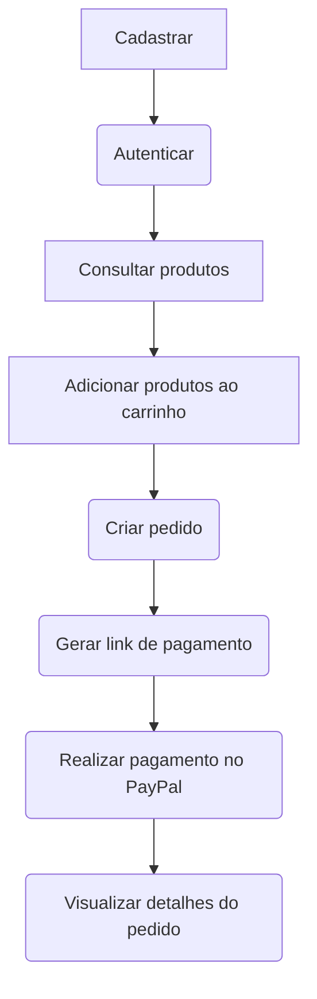

# <h1 align="center"> Projeto E-commerce com Java e Spring Boot </h1>
<p align="center">

</p>

<p align="center">


</p>
<hr>

#### Projeto
Este projeto é uma aplicação de e-commerce desenvolvida com Java e Spring Boot, permitindo aos usuários realizar compras de produtos. O sistema oferece as funcionalidades de autenticação e gerenciamento de usuários, produtos, pedidos e endereços.

#
#### Funcionalidades

-  CRUD de usuário: Cadastro, consulta, atualização e exclusão de usuários.

- CRUD de endereço: Cadastro, consulta, atualização e exclusão de endereços.

- CRUD de produto: Cadastro, consulta, atualização e exclusão de produtos.

- CRUD de pedido: Cadastro, consulta e exclusão de pedidos.

- Carrinho de compras por sessão: Adicionar, remover produtos e visualizar o carrinho da sessão do usuário.

- Autenticação: Sistema de autenticação para acesso a api.

- Integração com PayPal: Realização de pagamentos utilizando a plataforma PayPal.


----

#### URL Deploy
> 

#

### Rotas
#
### Autenticação
| Método      | Rota        | Descrição | JSON |
| ----------- | ----------- | ---------- | ----------  |
| POST         | /api/auth       | Retornar o Bearer token <br> necessário nas requisições |  <pre>{<br>"email": "joao.silva@email.com",<br>"senha": "senha123"<br>}</pre>|

#

### 1 Usuário
#### 1.1 Retornar Usuários
| Método | Rota | Descrição                  | 
| --- | --- |----------------------------|
|GET | /api/users | Retornar todos os Usuários |

##### Ordenação
```
/api/users?sort=id,desc
```
##### Paginação
```
/api/users?page=0&size=2
```


#

#### 1.2 Obter Usuário por ID

| Método | Rota            | Descrição                  | 
| --- |-----------------|----------------------------| 
|GET | /api/users/{id} | Retornar um Usuário por id |


#

#### 1.3 Obter Usuário com Endereços

| Método | Rota                      | Descrição                           |
|--------|---------------------------|-------------------------------------|
| GET    | /api/users/{id}/enderecos | Retornar o Usuário e seus Endereços |


#

#### 1.4 Cadastrar Usuário

| Método | Rota | Descrição            | JSON | 
| --- | --- |----------------------| --- | 
|POST | /api/users/ | Cadastrar um Usuário | <pre>{<br>  "nome": "João da Silva",<br/>  "email": "joao.silva@email.com",<br/>  "senha": "senha123",<br/>  "telefone": "(99) 9999-9999",<br/>  "dataNascimento": "1990-01-01",<br/>  "enderecos": [<br>     {<br>        "logradouro": "Rua Ulisses Lengruber", <br>        "cep": "28640-000",<br>        "numero": "383",<br>        "cidade": "Carmo"<br>      },  <br>      {<br>        "logradouro": "Rua Ulisses Lengruber",<br>        "cep": "28640-000",<br>        "numero": "175",<br>        "cidade": "Carmo"<br>      }<br>   ]<br>}</p>
</pre> |

| Nome  | Descrição   | 
| --- |-------------| 
|nome | Obrigatório |
|email | Obrigatório |
|senha | Obrigatório |
|telefone | Obrigatório |
|dataNascimento | Obrigatório |
|enderecos | Opcional    |


#
#### 1.5 Atualizar Usuário

| Método | Rota            | Descrição            | JSON                                                                                     | 
|--------|-----------------|----------------------|------------------------------------------------------------------------------------------| 
| PUT    | /api/users/{id} | Atualizar um Usuário | <pre>{<br> "nome": "João Silva e Silva",<br> "email": joao.silva10@email.com <br>}</pre> |

| Nome  | Descrição   | 
| --- |-------------| 
|nome | Opcional    |
|email | Opcional |
|senha | Opcional |
|telefone | Opcional |
|dataNascimento | Opcional |


#

#### 1.6 Deletar Usuário
| Método | Rota | Descrição              |
| --- | --- |------------------------|
|DEL | /api/users/{id} | Deletar Usuário por Id |

<hr>

### 2 Endereços

#### 2.1 Cadastrar Endereços
| Método | Rota               | Descrição                     | JSON |
|--------|--------------------|-------------------------------|------|
| POST   | /api/endereco/{id} | Cadastrar Endereco no Usuário | <pre>{<br>    "logradouro": "Rua Ulisses Lengruber", <br>    "cep": "28640-000",<br>    "numero": "383",<br>    "cidade": "Carmo"<br> }  <br></p>
 </pre> |


| Nome  | Descrição   | 
| --- |-------------| 
|logradouro | Obrigatório |
|cep | Obrigatório |
|numero | Obrigatório |
|cidade | Obrigatório |


#### 2.2 Atualizar Endereço

| Método | Rota               | Descrição                    | JSON |
|--------|--------------------|------------------------------|------|
| PUT    | /api/endereco/{id} | Atualizar Endereco | <pre>{<br>    "logradouro": "Rua Ulisses Lengruber", <br>    "cep": "28640-000",<br>    "numero": "383",<br>    "cidade": "Carmo"<br> }  <br></p>
 </pre> |

| Nome  | Descrição   |
| --- |-------------|
|logradouro | Opcional |
|cep | Opcional |
|numero | Opcional |
|cidade | Opcional |


#

#### 2.3 Tornar Endereço Principal

| Método | Rota               | Descrição                 |
|--------|--------------------|---------------------------|
| PATCH  | /api/endereco/{id} | Tornar Endereço Principal |


#

#### 2.4 Deletar Endereço

| Método | Rota | Descrição        | 
| --- | --- |------------------| 
|POST | /api/endereco/{id} | Deletar Endereço |

<hr>

### 2 Produto

#### 2.1 Cadastrar Produto
| Método | Rota         | Descrição         | JSON                                                                                                                                                                                                                                                                                                                                                                             |
|--------|--------------|-------------------|----------------------------------------------------------------------------------------------------------------------------------------------------------------------------------------------------------------------------------------------------------------------------------------------------------------------------------------------------------------------------------|
| POST   | /api/produto | Cadastrar Produto | <pre>{ <br>   "nome": "Nome do produto 1",<br>   "descricao": "Descrição do produto 1",<br>   "preco": 100,<br>   "categoria": "Categoria do produto 1",<br>   "marca": "Marca do produto 1",<br>   "images": [<br>     "https://www.example.com/image1.jpg",<br>     "https://www.example.com/image2.jpg",<br>     "https://www.example.com/image3.jpg"<br>   ] <br>}</p></pre> |


| Nome  | Descrição   | 
| --- |-------------| 
|nome | Obrigatório |
|descricao | Obrigatório |
|preco | Obrigatório |
|categoria | Obrigatório |
|marca | Obrigatório |
|images | Obrigatório |


#### 2.2 Atualizar Produto

| Método | Rota               | Descrição         | JSON |
|--------|--------------------|-------------------|------|
| PUT    | /api/produto{id} | Atualizar Produto | <pre>{<br>    "logradouro": "Rua Ulisses Lengruber", <br>    "cep": "28640-000",<br>    "numero": "383",<br>    "cidade": "Carmo"<br> }  <br></p>
 </pre> |

| Nome  | Descrição   |
| --- |-------------|
| nome | Opcional |
| descricao | Opcional |
| preco | Opcional |
| categoria | Opcional |
| marca | Opcional |
| images | Opcional |


#

#### 2.3 Obter Produtos

| Método | Rota            | Descrição                |
|--------|-----------------|--------------------------|
| GET    | /api/produto | Listar todos os produtos |

##### Ordenação
```
/api/produto?sort=id,desc
```
##### Paginação
```
/api/produto?page=0&size=2
```


#

#### 2.4 Obter Produto por ID

| Método | Rota              | Descrição             | 
|--------|-------------------|-----------------------| 
| GET    | /api/produto/{id} | Listar produto por ID |


#### 2.5 Deletar Produto

| Método | Rota              | Descrição       | 
| --- |-------------------|-----------------| 
|POST | /api/produto/{id} | Deletar Produto |

<hr>

### 3 Carrinho

#### 3.1 Adicionar Produto ao Carrinho
| Método | Rota                  | Descrição               | JSON                                                                 |
|--------|-----------------------|-------------------------|----------------------------------------------------------------------|
| POST   | /api/produto/carrinho | Add produto ao carrinho | <pre>{ <br>   "produtoId": 2,<br>   "quantidade": 1,<br> }</p></pre> |

| Nome  | Descrição   |
| --- |-------------|
|produtoId | Obrigatório |
|quantidade | Obrigatório |


#

#### 3.2 Obter Carrinho

| Método | Rota              | Descrição                | 
|--------|-------------------|--------------------------| 
| GET    | /api/carrinho/itens | Listar itens do carrinho |


#

#### 3.3 Remover Item do Carrinho

| Método | Rota               | Descrição                | 
|--------|--------------------|--------------------------| 
| DEL    | /api/carrinho/{id} | Remover item do carrinho |


<hr>

### 4 Pedido

#### 4.1 Criar Pedido

| Método | Rota              | Descrição                                     | 
|--------|-------------------|-----------------------------------------------| 
| POST   | /api/pedido/novo | Criar um novo pedido com os itens do Carrinho |


#

#### 4.2 Pagar Pedido

| Método | Rota                   | Descrição                                                     | 
|--------|------------------------|---------------------------------------------------------------| 
| POST   | /api/pedido/pagar/{id} | Pega os itens do pedido e cria um link de pagamento no PayPal |


Após concluir o pagamento, o usuário é redirecionado para a página de sucesso e o Status do pedido é alterado para PAGO.

#

#### 4.3 Obter Pedidos

| Método | Rota              | Descrição              | 
|--------|-------------------|------------------------| 
| GET    | /api/pedido/pedidos | Obter lista de pedidos |


